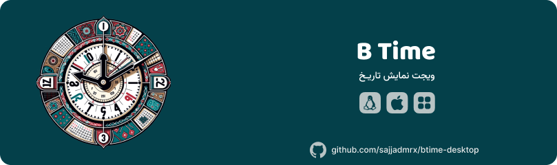

# ✍ معرفی

    

    
     

 
    
    
    
    
    

ویجت نمایش تاریخ و آب و هوا برای سیستم عامل های ویندوز،مک، لینوکس

<video src=".github/assets/b-time.mp4" controls title="B time" w="10" h="10"></video>

- [✍ معرفی](#-معرفی)
  - [📥 دانلود](#-دانلود)
  - [📝 تغییرات](#-تغییرات)
- [🛡️ حریم خصوصی](#️-حریم-خصوصی)
  - [🛠 همکاری](#-همکاری)

## 📥 دانلود

جهت دانلود [اینجا](https://github.com/sajjadmrx/btime-desktop/releases) کلیک کنید و نسخه مورد نظر رو انتخاب کنید.
| Platform | Status |
|----------|----------|
| Windows | ✅ Stable|
| MacOS | ✅ Stable |
| Linux | ✅ Stable |

## 📝 تغییرات

شما میتونید تغییرات رو از [changelog](changelog.md) مشاهده کنید

# 🛡️ حریم خصوصی

این برنامه به هیچگونه از اطلاعات سیستم شما دسترسی ندارد و فقط از سیستم آنالیز جهت بهبود عملکرد و... استفاده میکند.

## 🛠 همکاری

[CONTRIBUTING.md](./CONTRIBUTING.md)

درحال تکمیل فایل توضیحات....
